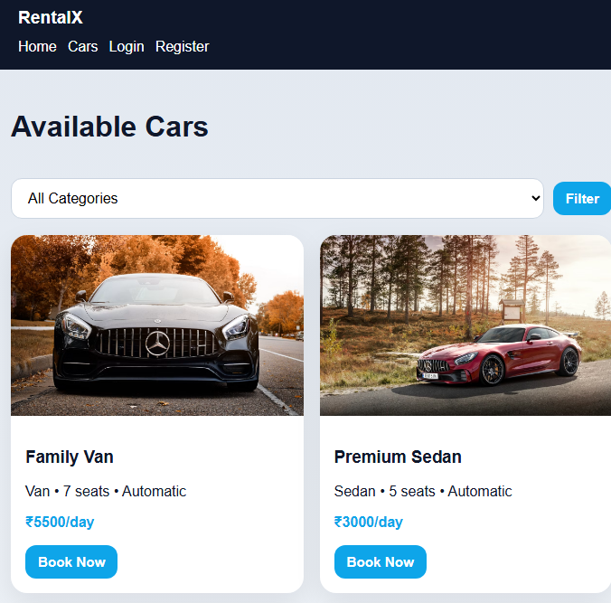

# 🚗 Car Rental Full Stack App

A full-stack car rental web application built using Flask, SQLite, HTML, and CSS.  
This project simulates a real-world car booking system with user and admin functionality.

---

## ✨ Features

- User Registration and Login
- Browse available cars
- Book cars with date selection
- Booking conflict detection
- Admin dashboard (Add / Edit / Delete cars)
- Booking cancellation

---

## 🛠️ Tech Stack

- Python (Flask)
- SQLite Database
- HTML & CSS
- SQLAlchemy

---

## 📸 Demo



---

## 🚀 Setup Instructions

### Clone the repository
```bash
git clone https://github.com/Aakashballa/car-rental-fullstack.git
cd car-rental-fullstack

---

## Create virtual environment
```bash
python -m venv .venv

===
## Activate virtual environment (Windows)
```bash
.venv\Scripts\activate

---

## Install dependencies
```bash
pip install -r requirements.txt

---

## Run the application
```bash
python app.py

---

## Open in browser
```bash
http://127.0.0.1:5000

---

## 👑 Admin Login

Email: admin@rentalx.com
Password: admin123

---

## 📁 Project Structure

car-rental-fullstack/
│
├── app.py
├── requirements.txt
├── README.md
├── static/
├── templates/
├── screenshots/

---

## 🎯 Future Improvements

Payment integration
Email notifications
Cloud database (PostgreSQL)
Live deployment

---

## 👨‍💻 Author
Akash Balla
Aspiring Software Developer 🚀

---

## 📄 License
MIT License
